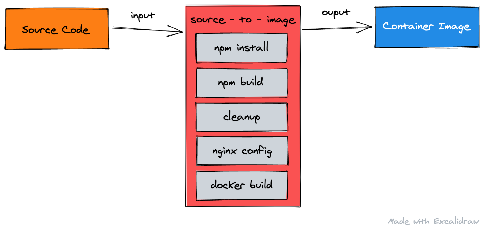

# S2I: Node.js / NGINX

This is an updated fork of 
[jshmrtn/s2i-nodejs-nginx](https://github.com/jshmrtn/s2i-nodejs-nginx), that
builds on their incredible work - thank you jshmrtn! 🤘

## Usage

```bash
# The repository containing the static application you'd like to build
export REPO_URL=https://github.com/evanshortiss/s2i-nodejs-nginx-example

# Name for the resulting image tag
export OUTPUT_IMAGE_NAME=nginx-webapp-runner

# Build the specified repo using the latest Node.js version,
# and serve it using the latest NGINX available in Alpine linux
s2i build $REPO_URL quay.io/evanshortiss/s2i-nodejs-nginx:latest $OUTPUT_IMAGE_NAME
```

## What Does it Do?

When used in conjunction with [s2i (source-to-image)](https://github.com/openshift/source-to-image#installation),
it bundles the source code for a webapp that is built using Node.js tools, and
produces a runnable container image that serves the content using NGINX.

The process is illustrated in the diagram below:



## Supported Version Combinations

* Node.js 14 and NGINX 1.18 (14-nginx1.18 / latest)
* Node.js 14 and NGINX 1.16 (14-nginx1.16)
* Node.js 12 and NGINX 1.18 (12-nginx1.18)
* Node.js 12 and NGINX 1.16 (12-nginx1.16)
* Node.js 10 and NGINX 1.18 (10-nginx1.18)
* Node.js 10 and NGINX 1.16 (10-nginx1.16)

Each of these is available at [quay.io/evanshortiss/s2i-nodejs-nginx](https://quay.io/repository/evanshortiss/s2i-nodejs-nginx)
in the format `quay.io/evanshortiss/s2i-nodejs-nginx:14-nginx1.18`.

Minor Node.js versions cannot be specified. Each tag is built using the Node.js
Alpine base images from Docker Hub, e.g `14-alpine`.

## Detailed Usage Instructions

### Application Prerequisites

The web application being built using this builder must:

1. Contain a `build` entry in the `scripts` section of the *package.json*
1. The `build` script must produce a *dist/* folder in the root of the repository (it can be added to *.gitignore*)
1. An *index.html* must be at the root of the *dist/* folder
1. All other static assets must be included in the *dist/* relative to *index.html*

A sample application that satisfies these requirements can be found [here](https://github.com/evanshortiss/s2i-nodejs-nginx-example).

### yarn/npm

If the builder detects a *yarn.lock* in your repository it will use yarn
instead of npm to install dependencies and execute the *build* script in your
*package.json*.

### Source to Image (s2i) CLI

You need to install [s2i](https://github.com/openshift/source-to-image#installation)
and [Docker](https://docs.docker.com/get-docker/) before running the `s2i build`
command below to generate a container image.

```bash
# Node.js version used for building the app, and NGINX the version for serving
export BUILDER_VERSION=14-nginx1.18

# The repository containing the application you'd like to build
export REPO_URL=https://github.com/evanshortiss/s2i-nodejs-nginx-example

# Name for the resulting image tag
export OUTPUT_IMAGE_NAME=nginx-webapp-runner

s2i build $REPO_URL quay.io/evanshortiss/s2i-nodejs-nginx:$BUILDER_VERSION $OUTPUT_IMAGE_NAME
```

This will produce a container named `nginx-webapp-runner` that can be started
via `docker run -p 8080:8080 nginx-webapp-runner`.

### OpenShift CLI

With the [OpenShift CLI (`oc`)](https://docs.openshift.com/container-platform/4.4/cli_reference/openshift_cli/getting-started-cli.html)
you can deploy the static site using the following command:

```bash
# Node.js version to use for building the application (does not support minor versions)
export BUILDER_VERSION=14-nginx1.16

# The repository containing the application you'd like to build
export REPO_URL=https://github.com/evanshortiss/s2i-nodejs-nginx-example

oc new-app quay.io/evanshortiss/s2i-nodejs-nginx:$BUILDER_VERSION~$REPO_URL
```

This will create a **BuildConfig** and the other necessary API Objects on
your OpenShift instance to build the application via source-to-image and deploy
it.

## Configuration

### Defaults

The out of the box configuration does the following:

* Listens on port 8080
* Serves *dist/index.html* for the `/` route
* Applies GZIP compression to text-based assets larger than 1000 bytes
* Logs at INFO level to stdout
* Includes NGINX default mime type mappings

### Environment Variables

#### Build-time

Set these during an s2i build using the `--env` flag, or on the **BuildConfig** in OpenShift:

* BUILD_OUTPUT_DIR (default: `dist`):
  * Tells the build image where `npm run build` places assets.
  * For example, if using [Create React App](https://create-react-app.dev/docs/production-build) you need to set `BUILD_OUTPUT_DIR=build`.
  * With Webpack you might use a custom output directory, so you set `BUILD_OUTPUT_DIR=my-custom-dir`

#### Runtime

These can be set when running the built container. Currently none are supported.


### Customising nginx.conf

You can add your custom `nginx.conf` to the container. While assembling, the builder looks for a nginx.conf file in your project `.s2i/nginx` directory. If there is a `nginx.conf` present at `.s2i/nginx/nginx.conf`, it will copy all contents of the `.s2i/nginx/` directory and put it into the target images `/opt/app-root/etc` directory. There the custom nginx.conf file will be used.

### nginx.conf includes

You can include files in your custom configuration. This is useful if you have many configuration files. If you provide the builder with a custom nginx.conf file in your projects `.s2i/nginx/` directory, all other files inside `.s2i/nginx/` will be copied along as well. So you could for example include a file with mime types in your custom nginx.conf. Add the file `.s2i/nginx/mime.types` to your project and include it like this:

```
include /opt/app-root/etc/mime.types;
```

### Basic Auth

The builder can add basic auth to the container for you. All you need to do is
to set some environment variables.

*Note: These must be set on the OpenShift BuildConfig*

* `BASICAUTH_USERNAME` - the username used for basic auth.
* `BASICAUTH_PASSWORD` - the password used for basic auth.
* `BASICAUTH_TITLE` - the title used for basic auth.

## Tips for Testing and Development

If you'd like to contribute, then being able to test locally is a must. Here
are some helpful commands to get running locally:

### Build a Builder Image 

This will produce a builder image that uses Node.js 14 and NGINX 1.18:

```bash
export NODE_VERSION=14
export NGINX_VERSION=1.18

# Must set the APK_REPO to 3.12 find NGINX 1.18
export APK_REPO=http://dl-cdn.alpinelinux.org/alpine/v3.10/main

docker build . -f alpine.Dockerfile \
--build-arg NODE_VERSION=$NODE_VERSION \
--build-arg NGINX_VERSION=$NGINX_VERSION \
--build-arg APK_REPO=$APK_REPO \
-t s2i-webapp-builder
```

To use NGINX 1.16, change the `NGINX_VERSION` and `APK_REPO` variables:

```bash
export NODE_VERSION=14
export NGINX_VERSION=1.16

# Must set the APK_REPO to 3.10 find NGINX 1.16
export APK_REPO=http://dl-cdn.alpinelinux.org/alpine/v3.10/main

docker build . -f alpine.Dockerfile \
--build-arg NODE_VERSION=$NODE_VERSION \
--build-arg NGINX_VERSION=$NGINX_VERSION \
--build-arg APK_REPO=$APK_REPO \
-t s2i-webapp-builder
```

### Testing Builder Images

```bash
# The repository that s2i should clone and build
export REPO_URL="<the repo you want to build>"

# The BUILD_OUTPUT_DIR needs to be set to "build"  if the application in
# REPO_URL uses react-scripts build. Otherwise, change it according to your
# custom output directory, e.g dist
export BUILD_OUTPUT_DIR=build

# Perform an s2i build.

s2i build $REPO_URL --env BUILD_OUTPUT_DIR=$BUILD_OUTPUT_DIR s2i-webapp-builder s2i-webapp-runner


# Run the resulting image and expose it on port 8080
docker run -f --rm --name webapp -p 8080:8080 s2i-webapp-runner
```
